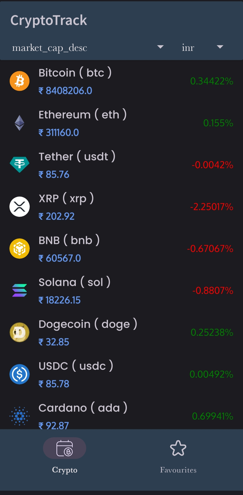
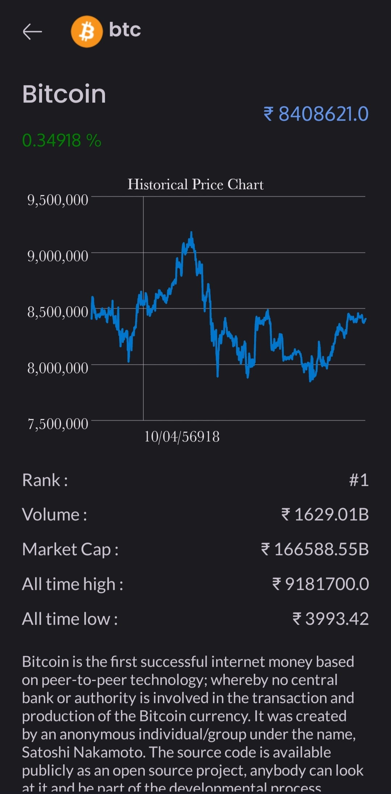

# CryptoTrack 📈💰

**CryptoTrack** is an Android app for tracking cryptocurrency prices and trends, built with Kotlin and XML. 
It provides real-time data using the CoinGecko API, supports multiple currencies, and features interactive graphs powered by the GraphView library.

---

## Features 🚀
- **Real-time Cryptocurrency Prices**: Fetch live data for various cryptocurrencies using the CoinGecko API.
- **Interactive Graphs**: Visualize trends with the GraphView library.
- **Multiple Currencies Support**: Switch between different fiat currencies for price comparison.
- **Modern Design**: Intuitive and responsive user interface built with Kotlin and XML.

---

## Screenshots 📸
<p align="center">
  
  
</p>

---

## Tech Stack 🛠️
- **Programming Language**: Kotlin
- **UI Design**: XML
- **Networking**: Retrofit
- **Graph Library**: GraphView
- **API**: [CoinGecko API](https://www.coingecko.com/en/api)

---

## Installation 📥
1. Clone the repository:
   ```bash  
   git clone https://github.com/shivamtechstack/Cryptocurrency-tracker.git  
Open the project in Android Studio.
Sync Gradle files.
Build and run the app on an emulator or device.

## Contributions 🤝
Contributions are welcome! Feel free to fork the repository, create a branch, and submit a pull request with your changes.